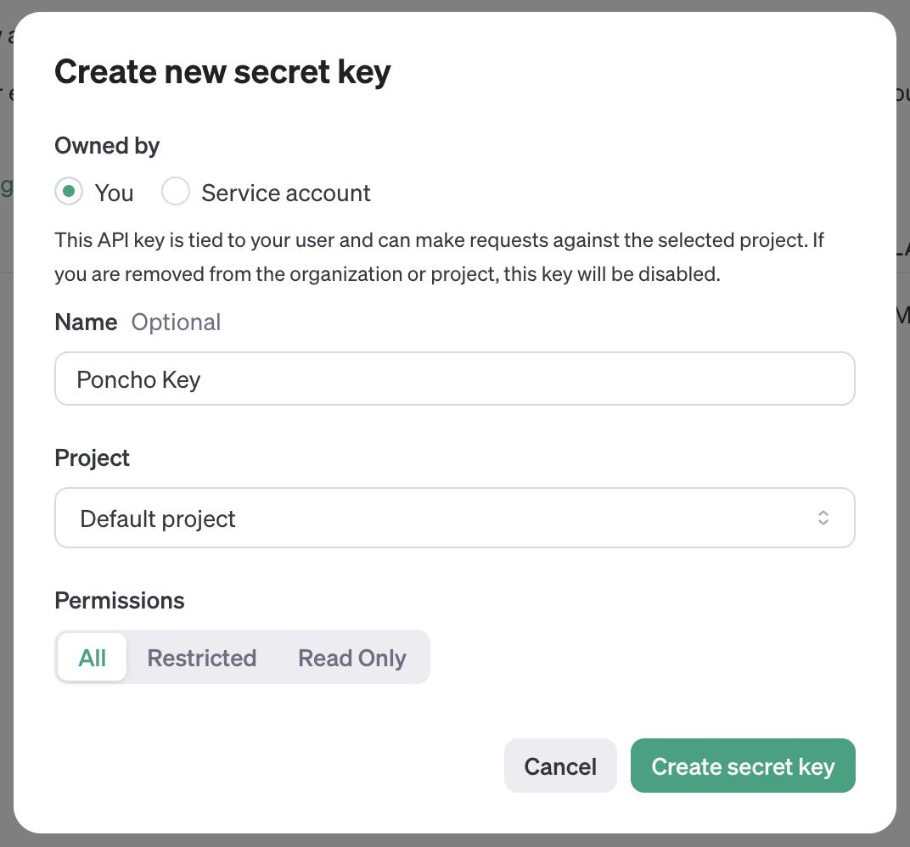

# Poncho: Uncategorized Website Management Tool For Cisco Umbrella
*"When it's raining in all directions, an Umbrella may not be enough; grab a Poncho."*

## Overview

Poncho addresses the challenge of managing uncategorized websites accessed by users on the Internet. It regularly retrieves Umbrella logs to identify destinations lacking categorization. Poncho can then employ OpenAI to analyze website content, assessing if it aligns with predefined categories. 

Administrators can review the findings via a web interface, where they can investigate each destination further and decide whether to add it to the Umbrella global block list.

The use of OpenAI analysis is optional and requires an OpenAI API account, subject to usage charges. In the absence of OpenAI integration, Poncho still provides a comprehensive list of uncategorized websites within the logs, offering administrators the ability to review sites and add destinations to the block list after manual review.

<center></center>

## Features

- **Umbrella Log Integration:** Pulls Umbrella logs to identify uncategorized destinations.
- **OpenAI Analysis (optional):** Utilizes OpenAI to assess website content against predefined categories.
- **Web Interface:** Provides administrators with a user-friendly interface to review and manage uncategorized destinations.
- **Global Block List Management:** Enables administrators to add destinations to the Umbrella global block list.

## Technologies & Frameworks Used

**Cisco Products:**

- Cisco Umbrealla

## Technologies Used

- **Python3:** Utilized for backend development (Flask, SQLite3, Gunicorn).
- **Frontend:** Bootstrap, jQuery, feathericon, DataTables.
- **Docker (Optional):** Provides containerization for easy deployment.
- **Web Proxy (Optional):** Nginx

## Installation and Operation

### Standalone (No Python Virtual Enviroment)

1. Clone the Poncho repository. `git clone https://github.com/PubSec-Security-DevNet/poncho.git`.
2. Install dependencies using `pip install -r requirements.txt`.
3. (Initital Setup Only) Copy config.yaml.example to config.yaml and edit. Add Umbrella and OpenAI API credentials and make other modifications as required. `cp config.yaml.exmple config.yaml`
4. Run the web application using `gunicorn --preload --workers=4 --bind 0.0.0.0:8000 poncho:app`.
    - Note, this example will run the web application without SSL on port 8000.  See gunicorn documentation or proxy the app behind Nginx, Apache, or other web server to add SSL.
5. Access the web interface at: `http://localhost:8000`.

### Standalone (Python Virtual Enviroment)

1. Clone the Poncho repository. `git clone https://github.com/PubSec-Security-DevNet/poncho.git`.
2. (Initital Setup Only) Create and activate a virtual environment. `python3 -m venv venv ; source venv/bin/activate`
3. Install dependencies using `pip install -r requirements.txt`.
4. (Initital Setup Only) Copy config.yaml.example to config.yaml and edit. Add Umbrella and OpenAI API credentials and make other modifications as required. `cp config.yaml.exmple config.yaml`
5. Run the web application using `venv/bin/gunicorn --preload --workers=4 --bind 0.0.0.0:8000 poncho:app`.
    - Note, this example will run the web application without SSL on port 8000.  See gunicorn documentation or proxy the app behind Nginx, Apache, or other web server to add SSL.
6. Access the web interface at: `http://localhost:8000`.

### Docker

The Docker container can be set up to just use Gunicorn on port 8000, or it can use Nginx as a frontend to Gunicorn and provide SSL support. To set up Nginx with SSL, copy `poncho.conf.example` to `poncho.conf` in the `docker/nginx` folder and modify it to your environment. Add your certificate to the `docker/nginx` directory and name it `cert-bundle.crt`. This file should include any intermediate certs if needed. Then, add your certificate's private key file to the `docker/nginx` directory and name it `cert.key`. There are two options for step 6 below based on if you're using just Gunicorn or Nginx.

1. Clone the Poncho repository: `git clone https://github.com/PubSec-Security-DevNet/poncho.git`.
2. (Initital Setup Only) Create a Docker volume for poncho's database: `docker volume create ponchodb`
3. (Initital Setup Only) Copy config.yaml.example to config.yaml and edit. Add Umbrella and OpenAI API credentials and make other modifications as required. `cp config.yaml.exmple config.yaml`
4. (Initial Setup Only & Optional) Configure Nginx as a web proxy, see above.
5. Build the Docker container: `docker build -t poncho-image . --no-cache`
6. Run the container:
- If just using Gunicorn run the container with the command below. Note, this will run the web application without SSL on port 8000. 
```
docker run -d --name poncho --mount source=ponchodb,destination=/app/data -p 8000:8000/tcp poncho-image
```
- If using Nginx as a proxy run the container with the command below.
```
docker run -d --name poncho --mount source=ponchodb,destination=/app/data -p 80:80/tcp -p 443:443/tcp poncho-image
```
7. Access the web interface at: `http://<your domain name>:8000` or `https://<your domain name>`.

## Poller

The Poller is responsible for querying Umbrella logs for uncategorized domains and then performing the OpenAI query, adding the data to the database. You can choose to run the Poller inline with the web process or separately. The setting for this `pollerEnabled`, is in the `config.yaml` file, and by default, the inline Poller is disabled. For new installations, the Poller must be run at least once before the web service will function, as the Poller process creates the database for the first time.

To run the Poller from outside the web process, set up a cron or scheduled task on your operating system to call the Poller process at the same interval you set for `reportingLookback` in the `config.yaml` file.

Cron standaone example:

1. Edit /etc/crontab `vi /etc/crontab`
2. Add the crontab entry and save `*/15 * * * * /path/to/poncho/venv/bin/python3 /path/to/poncho/poller.py`.  Change /path/to/poncho to where you installed poncho.

Cron Docker example:

1. Edit /etc/crontab `vi /etc/crontab`
2. Add the crontab entry and save `*/15 * * * * docker exec poncho python3 /app/poller.py`.  

## Creating API Keys in Umbrella and OpenAI

### Umbrella

1. Login to Umbrella.
2. Navigate to Admin -> API Keys.
3. Press the Add button in the upper right corner of the screen.
4. Give the API Key a Name and Grant Scope Access as follows:
    - Policies / Destinations: Read/Write
    - Reports / Granular Events: Read-Only
    - Policies / Destination Lists: Read/Write
5. Copy the API Key and Key Secret to `config.yaml`.

<center></center>

### OpenAI

1. Login to your OpenAI Account.
2. Navigate to API Keys ([https://platform.openai.com/api-keys](https://platform.openai.com/api-keys)).
3. Press `Create new secret key`.
4. Enter a name for the new key and then press `Create secret key`.
5. Copy the key and place it in `config.yaml`.

<center></center>

## FAQ


1. How much does it cost to use OpenAI with Poncho?
    - Usage costs will vary based on the number of uncategorized sites Poncho finds in your Umbrella logs. Currently, Poncho is set to use the inexpensive gpt-3.5-turbo-0125 model. This model costs about $0.0005 per 1K tokens. By default, Poncho uses no more than 255 tokens per site lookup. Poncho will only query OpenAI for new sites not already in the internal Poncho database.
2. How accurate is OpenAI analysis?
    - This is dependent on the websites Poncho finds as uncategorized in your Umbrella logs. By default, Poncho is set to input a maximum of 250 tokens which may not be a complete website. While in testing, this number seems sufficient, you may have to adjust the token size in config.yaml to have OpenAI review more of a website and return more accurate results. Also, the analysis of a website with OpenAI is meant to guide an administrator on which uncategorized sites to focus on, not be the be-all, end-all opinion on what a website may contain for content.
3.  Is the Poncho DB backed up?
    - No, as Poncho uses SQLite3, there is a DB file (data/poncho.db) that gets created when poller.py runs. A backup of this file is recommended if you wish to restore from a lost or deleted DB file.

## Authors

- Nick Ciesinski

## License

Copyright 2024 Cisco Systems, Inc. or its affiliates

Licensed under the Apache License, Version 2.0 (the "License");
you may not use this file except in compliance with the License.
You may obtain a copy of the License at

http://www.apache.org/licenses/LICENSE-2.0

Unless required by applicable law or agreed to in writing, software
distributed under the License is distributed on an "AS IS" BASIS,
WITHOUT WARRANTIES OR CONDITIONS OF ANY KIND, either express or implied.
See the License for the specific language governing permissions and
limitations under the License.